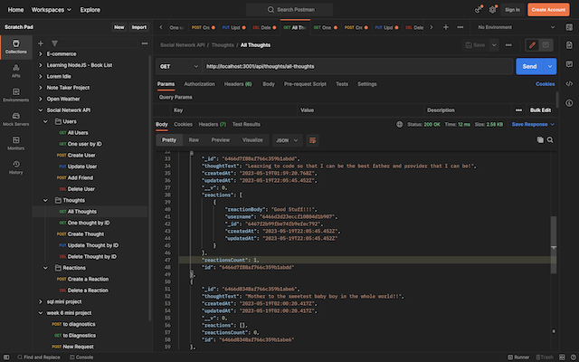

# Tech-blog

  

  ## Description:
        
  A backend API for a typical social network application. With this API, you are able to perform all CRUD operations on users, thoughts(posts), and reactions to thoughts. You can also add friends to a user.
    

  ## Demo:

  Please view a demo of the project [here](https://watch.screencastify.com/v/Zb5fpQXNLe3BeZPXq2eo).

  ---
  
  ## Table of Contents:
  
  - [Demo](#demo)
  - [Instillation](#instillation)
  - [Usage](#usage)
  - [Credits](#credits)
  - [License](#license)
  - [Questions](#questions)
  
  ## Instillation:
  
  Please intall by cloning the code to your personal machine to run in a code editor. 
  
  ## Usage:
  
  Interact with and learn about how the backend of a typical social network may be structured. This can also be used as a template to creating other API's for full stack social network applications.
  
  ## ScreenShots:

  ---
  

  

  

  

  ---
  ## Credits:
  Thirdparty-assets:
  - Node.js
  - Express
  - MongoDB
  - Mongoose
  
  
  
  ## License:
  
  This project uses the [MIT](https://opensource.org/licenses/MIT) license.

  ## Tests:

  ---
  
  ## Questions:

  Please feel free to get in contact if you have any questions about this project.

  - Github: [Jamesgit22](https://github.com/Jamesgit22)
  - Email: jamesschroedermail97@gmail.com